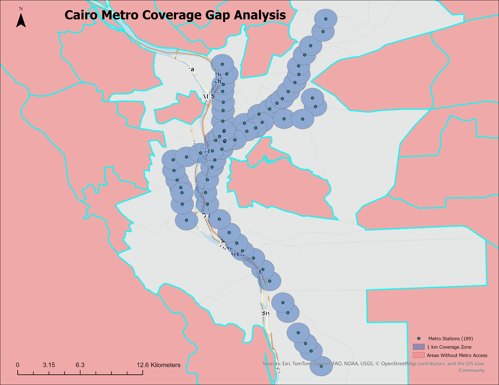

# Cairo Metro Coverage Gap Analysis

A GIS spatial analysis project identifying districts in Greater Cairo that fall outside a 1km walking-distance buffer from metro stations, built in ArcGIS Pro.



## 🎯 Objective

Which neighborhoods in Greater Cairo lack walkable access to the metro system? This project answers that question using a standard 1km (~10-15 min walk) service-area buffer around all metro stations, then identifies districts with no overlap.

## 🧰 Tools & Software

- **ArcGIS Pro** — spatial analysis, cartography, and layout design

## 📊 Data Sources

| Layer | Source | Format |
|---|---|---|
| Metro station locations | [Transport for Cairo — Metro GTFS](https://github.com/transportforcairo/Metro-GTFS) (Open Data Day Cairo 2016) | GTFS (`stops.txt`) |
| Administrative boundaries (Admin2 / districts) | [HDX — Egypt Subnational Administrative Boundaries](https://data.humdata.org/dataset/cod-ab-egy) (Source: CAPMAS) | Shapefile |

## 🔧 Methodology

1. **Data preparation** — Converted metro station coordinates (`stop_lat`, `stop_lon`) from the GTFS `stops.txt` file into point features using **XY Table To Point**.
2. **Study area definition** — Selected Cairo, Giza, and Qalyubia governorates from the national Admin1 boundary layer and exported them as the Greater Cairo study area.
3. **Clip** — Clipped the national Admin2 (district) layer to the Greater Cairo boundary, reducing ~365 nationwide districts to the 79 relevant to this study.
4. **Buffer analysis** — Generated a 1km buffer around all 189 metro stations using the **Buffer** tool.
5. **Spatial selection** — Used **Select By Location** (Intersect, inverted) to identify districts with zero overlap with the buffer zones — i.e., districts without metro coverage.
6. **Cartographic output** — Final map layout with title, legend, north arrow, and scale bar exported at 300 DPI.

## 📈 Key Finding

**36 of 79 districts (46%) in Greater Cairo fall outside the 1km metro walking-access zone.**

This highlights priority areas for future consideration: feeder bus routes, first/last-mile transit solutions, or future metro line extensions.

## 📁 Repository Contents

```
├── stops.csv       # Metro station coordinates (from GTFS)
├── Layout.png      # Final map export
└── README.md
```

## 🔭 Next Steps

- Weight underserved districts by population density to prioritize interventions
- Extend the analysis to bus and microbus routes for a fuller transit-access picture

## 👩‍💻 Author

Nada — GIS & Spatial Analysis | Power BI | Python | SQL
Transitioning into GIS/Spatial Analyst roles.

This is my second GIS portfolio project, following an earlier suitability analysis for Cairo Metro expansion.
